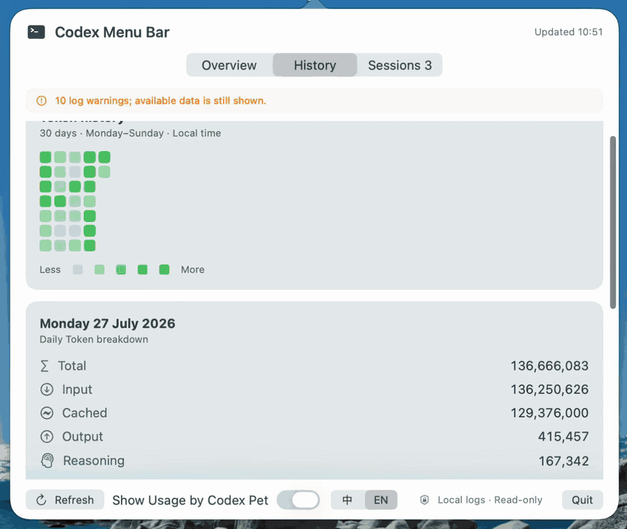

<p align="right">
  <strong>English</strong> |
  <a href="README.zh-CN.md">简体中文</a>
</p>

<div align="center">
  <h1>Codex Menu Bar</h1>
  <p>A native, local-only macOS menu bar dashboard for Codex usage, Token history, and live Codex sessions.</p>
  <p>
    
    
    
    
  </p>
</div>

<p align="center">
  <a href="docs/assets/codex-menubar-demo.mp4">
    
  </a>
</p>

<p align="center">
  <a href="docs/assets/codex-menubar-demo.mp4">Watch the high-quality MP4</a>
</p>

## Features

- **Overview** — see current rate-limit windows and each window's initial remaining percentage for today, a compact Token heatmap, and shortcuts to live sessions.
- **History** — explore the latest 60 local days with daily Total, Input, Cached, Output, and Reasoning details plus per-session breakdowns.
- **Sessions** — follow active top-level Codex terminal and Codex Desktop sessions, including activity, working directory, last update, and cumulative Tokens.
- **Private by design** — inspect local Codex data without accounts, network requests, analytics, or a background service.

## Pet Island

Pet Island keeps usage and live-session status visible in a movable floating
pet with an expandable task summary. It uses the same floating presentation on
MacBook displays and external monitors.

The island renders the user's local Codex custom pet in the same window as the
usage metrics, so the pet and status never need to be manually aligned. It
discovers read-only pet packages from:

- `~/.codex/pets/*/pet.json`
- `~/Library/Application Support/Codex/pets/*/pet.json`
- `~/Library/Application Support/ChatGPT/pets/*/pet.json`

Use **Pet Island** in the dashboard footer to show or hide the island, follow
the current local Codex pet, or explicitly choose an installed custom pet.
The expanded task summary includes a live pet-size slider from 75% to 300%;
click its percentage to restore the 100% default. The movable and expanded
windows grow with large pets, while the compact edge dock caps its pet at 125%.
An idle pet uses the manifest's idle animation while a live task uses its
directional running frames. Drag the pet left or right to move the panel and
change its running direction, including across connected displays.
Dropping it near either screen edge snaps the manifest's front-facing idle pet
into a circular quota dock. Its ring and badge keep the remaining percentage
and reset countdown visible without cropping or modifying the pet artwork. The
dock has no opaque circular backing or outer shadow. Click it to reveal the
summary, or drag it directly away from the edge to restore the movable pet.
By default it follows Codex's `selected-avatar-id` from `~/.codex/config.toml`.
If that value is missing or its package is unavailable, it falls back to the
newest canonical local pet package (the folder name matches the manifest `id`)
and ignores backup package folders. A pet id is stored in macOS user defaults
only after the user explicitly chooses one from this app. Pet packages are
never modified. If the Codex app's own pet overlay is enabled, turn one of the
two overlays off to avoid showing the same pet twice.

No pet artwork is bundled, copied, or redistributed by Codex Menu Bar. Every
rendered frame is loaded at runtime from the local manifest's
`spritesheetPath`, and the sprite layout follows its `spriteVersionNumber`.

## Language

Open the menu bar dashboard and use the compact **中 / EN** control beside
**Pet Island**. The preference is persisted in macOS user defaults and updates
both the dashboard and Pet Island.

## How usage detection works

Codex Menu Bar does not call a private usage API. It reads Codex's local,
append-only JSONL session logs under `~/.codex/sessions`:

- macOS FSEvents watches the directory with a 0.2-second delivery latency.
- A 60-second timer is the fallback when filesystem events are coalesced or
  unavailable.
- Filesystem bursts are coalesced and delivered at most once every two seconds,
  preventing rapid log writes from triggering repeated dashboard scans.
- The incremental index reads only bytes appended since the last cursor. It
  parses `token_count` events for cumulative input, cached-input, output,
  reasoning, total-token, and rate-limit fields.
- Daily totals are calculated from differences between consecutive cumulative
  counters. Remaining quota is `100 - used_percent`, and reset time comes from
  the event's `resets_at` value.
- The dashboard keeps 60 local-calendar days of history. Files opened by a live
  Codex process are retained even when they fall outside the normal history
  filter.

## Why Codex Menu Bar

Codex already records useful local session data, but checking usage and understanding activity across days usually means leaving your current workflow. Codex Menu Bar turns that data into a small, read-only SwiftUI dashboard available directly from the macOS menu bar.

The menu bar item shows the primary usage remaining and the number of live interactive sessions. Click it to open the Overview, History, and Sessions pages.

## Privacy and read-only design

The app:

- reads `~/.codex/sessions/**/*.jsonl` and `~/.codex/session_index.jsonl`;
- inspects current-user process metadata and writable rollout file associations to identify interactive TUIs;
- does **not** read Codex credentials or `auth.json`;
- does **not** make network requests;
- does **not** write a cache, database, analytics, or log file;
- does **not** start, stop, or otherwise control Codex sessions.

Session JSONL files are streamed in bounded chunks. While the app is running, appended bytes update in-memory daily summaries; raw historical Token events are not retained. The index is never written to disk, so restarting the app performs a fresh streaming scan.

History includes every indexed local rollout source from the latest 60 local calendar days. The live Sessions page includes top-level interactive terminal sessions and user sessions currently open in Codex Desktop. At most 10,000 ordinary logs are indexed, plus every log required by a currently running session.

## Token semantics

Codex records cumulative Token counters. The app converts consecutive cumulative values into increments, handles counter resets independently, and groups increments by system-local calendar day.

`Total` is used as reported. Cached input and Reasoning are shown as detail fields and are never added to Total again.

## Requirements

- macOS 14 or later
- Xcode 16 or Swift 6 command-line tools
- A local Codex installation with session data under `~/.codex`

Install Apple's command-line developer tools if needed:

```bash
xcode-select --install
```

## Quick start

### Download the Apple Silicon preview

> [!WARNING]
> This free preview is built for Apple Silicon Macs, uses an ad-hoc signature, and is not Apple-notarized. macOS may block the first launch.

- [Download Codex Menu Bar v0.3.4](https://github.com/Benjamin-Island/codex-menubar-tools/releases/download/v0.3.4/CodexMenuBar-v0.3.4-apple-silicon.zip)
- [SHA-256 checksum](https://github.com/Benjamin-Island/codex-menubar-tools/releases/download/v0.3.4/CodexMenuBar-v0.3.4-apple-silicon.zip.sha256)

Unzip the download, move `CodexMenuBar.app` to `Applications`, then right-click the app and choose **Open** for the first launch. If macOS still refuses to open it, build from source instead of disabling system-wide security controls.

### Release history

| Version | Released | Highlights |
| --- | --- | --- |
| [v0.3.4](https://github.com/Benjamin-Island/codex-menubar-tools/releases/tag/v0.3.4) | 2026-07-25 | Initial remaining usage for today |
| [v0.3.3](https://github.com/Benjamin-Island/codex-menubar-tools/releases/tag/v0.3.3) | 2026-07-24 | Live Codex Desktop session tracking |
| [v0.3.2](https://github.com/Benjamin-Island/codex-menubar-tools/releases/tag/v0.3.2) | 2026-07-21 | Outside-click popover dismissal |
| [v0.3.1](https://github.com/Benjamin-Island/codex-menubar-tools/releases/tag/v0.3.1) | 2026-07-21 | Quieter oversized-log handling |
| [v0.3.0](https://github.com/Benjamin-Island/codex-menubar-tools/releases/tag/v0.3.0) | 2026-07-21 | 60-day incremental usage history |
| [v0.2.1](https://github.com/Benjamin-Island/codex-menubar-tools/releases/tag/v0.2.1) | 2026-07-21 | Token Prism icon |
| [v0.2.0](https://github.com/Benjamin-Island/codex-menubar-tools/releases/tag/v0.2.0) | 2026-07-21 | Apple Silicon preview |

[View all releases](https://github.com/Benjamin-Island/codex-menubar-tools/releases)

### Build from source

Clone the repository, build the app locally, and open it:

```bash
git clone https://github.com/Benjamin-Island/codex-menubar-tools.git
cd codex-menubar-tools
codex-menubar/macos/CodexMenuBar/scripts/build-app.sh
open codex-menubar/macos/CodexMenuBar/dist/CodexMenuBar.app
```

The app runs only in the menu bar and has no Dock icon. The first scan may take a little longer for large Codex histories; later refreshes validate the recorded file boundary and read only appended bytes whenever possible.

Optional path overrides are available for development:

```bash
CODEX_SESSIONS_DIR=/path/to/sessions \
CODEX_SESSION_INDEX=/path/to/session_index.jsonl \
codex-menubar/macos/CodexMenuBar/dist/CodexMenuBar.app/Contents/MacOS/CodexMenuBar
```

## Data and Token semantics

Codex records cumulative Token counters. The app converts consecutive cumulative values into increments, handles counter resets independently, and groups increments by the system's local calendar day.

`Total` is used as reported. Cached input and Reasoning are detail fields and are never added to Total again.

## Test

From the repository root:

```bash
swift test --package-path codex-menubar/macos/CodexMenuBar
```

The suite covers parser, aggregation, rate-limit, process-classification, routing, SwiftUI layout, and read-only live smoke behavior.

## Notes

- This is an independent project, not an official OpenAI application.
- Usage data comes from local Codex session events, not an official Usage API.
- Locally built copies are ad-hoc signed and not notarized. If macOS blocks the first launch, right-click the app and choose **Open**.
