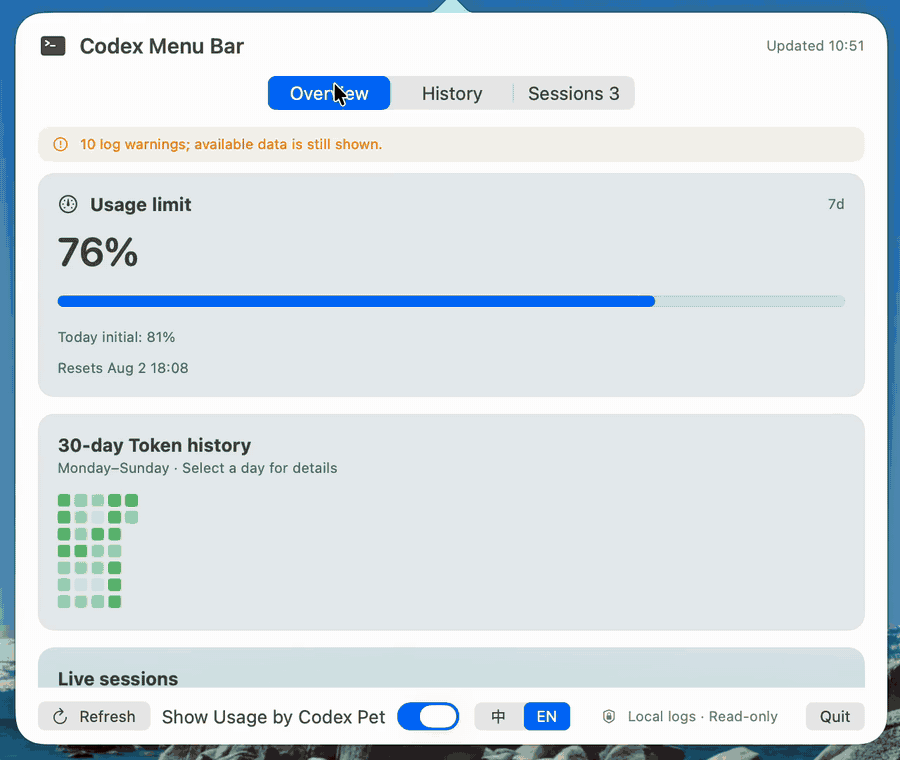

<p align="right">
  <a href="README.md">English</a> |
  <strong>简体中文</strong>
</p>

<div align="center">
  <h1>Codex Menu Bar</h1>
  <p>原生、仅本地运行的 macOS 菜单栏仪表盘，用于查看 Codex 用量、Token 历史记录和实时 Codex 会话。</p>
  <p>
    
    
    
    
  </p>
</div>

<p align="center">
  <a href="docs/assets/codex-menubar-demo.mp4">
    
  </a>
</p>

<p align="center">
  <a href="docs/assets/codex-menubar-demo.mp4">观看高清 MP4 视频</a>
</p>

## 核心功能

- **概览** — 查看当前速率限制周期及各周期今日初始剩余百分比、紧凑的 Token 热力图，以及实时会话快捷入口。
- **历史记录** — 浏览最近 30 个本地自然日的数据，包括每天的 Total、Input、Cached、Output、Reasoning 明细和各会话分项。
- **会话** — 跟踪活跃的顶层 Codex 终端会话和 Codex Desktop 会话，并显示活动状态、工作目录、最后更新时间和累计 Token。
- **隐私优先** — 无需账户、网络请求、分析服务或后台服务，即可查看本地 Codex 数据。

## 原生 Pet 用量徽标

Codex Menu Bar 可以在 Codex Desktop 自带的原生 Pet 旁显示一个小型 **Primary 剩余额度**徽标，不再创建或渲染第二只宠物。点击徽标会打开紧凑摘要，显示当前项目或任务、Primary 与 Secondary 剩余百分比，以及运行中的会话数量。

<p align="center">
  <a href="docs/assets/codex-pet-usage-demo.mp4">
    
  </a>
</p>

<p align="center">
  <a href="docs/assets/codex-pet-usage-demo.mp4">观看原生 Pet 用量徽标高清 MP4 视频</a>
</p>

在仪表盘底部启用**在 Codex 宠物旁显示额度**，然后在 Codex Desktop 中显示原生 Pet。徽标会跟随 Pet 跨显示器移动；Pet 移动时会关闭摘要，Pet 被收起或无法被安全识别时会自动隐藏。关闭摘要不会移动 Pet 或徽标。

检测过程只读取本机 Codex Desktop 进程的窗口元数据，不读取宠物素材或 Codex 配置，也不需要“辅助功能”权限。为了识别原生 Pet 窗口，macOS 会要求授予 **“屏幕录制”**权限。第一次启用徽标时，请批准系统授权请求，并在提示后重启 Codex Menu Bar。

由于预览版采用 ad-hoc 签名，App 更新后，之前可用的“屏幕录制”授权可能失效，即使系统设置仍显示为已开启。Codex Menu Bar 检测到这种情况时，请点击**重置并重新授权**并确认提示。修复只会清除本 App 的“屏幕录制”权限记录，随后重新请求 macOS 授权，而且绝不会自动执行。

## 语言

打开菜单栏仪表盘，使用**在 Codex 宠物旁显示额度**旁的紧凑型
**中 / EN** 控件切换语言。该偏好会保存在 macOS 用户默认设置中，
并同时更新仪表盘和原生 Pet 用量徽标。

## 用量检测原理

Codex Menu Bar 不调用私有用量 API，而是读取
`~/.codex/sessions` 下由 Codex 写入的本地、只追加 JSONL 会话日志：

- macOS FSEvents 以 0.2 秒的传递延迟监视会话目录。
- 当文件系统事件被合并或不可用时，由 60 秒定时器兜底刷新。
- 文件系统突发事件会被合并，每两秒最多触发一次刷新，避免快速写入日志时反复扫描。
- 增量索引只读取上次游标之后新增的字节，并解析 `token_count` 事件中的累计 Input、Cached input、Output、Reasoning、Total 和速率限制字段。
- 会话元数据只读取第一行，最多 256 KiB；历史文件只从最近 30 个按日期分区的目录中发现。
- 本地解析状态缓存保存文件标识、大小、修改时间、解析偏移和每日汇总。冷扫描可跨多次刷新继续，每轮最多读取 64 MiB、单文件最多 16 MiB，或运行 500 ms。
- 每日 Token 总量由相邻累计计数器之间的差值计算。剩余额度为 `100 - used_percent`，重置时间来自事件的 `resets_at` 字段。
- 仪表盘保留最近 30 个本地自然日的数据；实时 Codex 进程打开的文件即使超出常规历史筛选范围也会保留。

## 为什么使用 Codex Menu Bar

Codex 已经记录了实用的本地会话数据，但检查用量或了解多日活动通常需要离开当前工作流。Codex Menu Bar 将这些数据整理成小巧的只读 SwiftUI 仪表盘，可直接从 macOS 菜单栏打开。

菜单栏图标会显示主要用量的剩余额度和实时交互会话数量。点击图标即可打开“概览”“历史记录”和“会话”页面。

## 隐私与只读设计

本应用：

- 读取 `~/.codex/sessions/**/*.jsonl` 和 `~/.codex/session_index.jsonl`；
- 检查当前用户的进程元数据，以及可写 rollout 文件的关联信息，以识别交互式 TUI；
- **不会**读取 Codex 凭据或 `auth.json`；
- **不会**发起网络请求；
- 只会在 macOS Caches 目录写入本地解析状态缓存，并在 macOS 用户默认设置中保存应用偏好；
- **不会**修改 Codex 数据；只有用户明确确认后，“屏幕录制”权限修复才会重置本 App 自己的权限记录；
- **不会**写入数据库、分析数据或日志文件；
- **不会**启动、停止或以其他方式控制 Codex 会话。

会话 JSONL 文件以有界数据块流式读取。新增字节用于更新每日汇总，原始历史 JSONL 记录不会复制到缓存中。应用重启后会恢复经过验证的逐文件游标，只继续读取新增或尚未完成的字节范围。

“历史记录”包含最近 30 个本地自然日内所有已建立索引的本地 rollout 来源。冷扫描尚未完成时，界面会明确显示“统计中/部分数据”和剩余文件数，不会把部分结果冒充完整历史。今日初始剩余额度由独立的今日快速索引提供，无需等待 30 天历史完成。“会话”页面显示顶层交互式终端会话，以及 Codex Desktop 中当前打开的用户会话。应用最多索引 10,000 个普通日志，并额外包含当前运行会话所需的全部日志。

## 系统要求

- macOS 14 或更高版本
- Xcode 16 或 Swift 6 命令行工具
- 已在 `~/.codex` 下生成会话数据的本地 Codex 安装

如有需要，请安装 Apple 命令行开发工具：

```bash
xcode-select --install
```

## 快速开始

### 下载 Apple Silicon 预览版

> [!WARNING]
> 此免费预览版面向 Apple Silicon Mac，使用临时签名且未经 Apple 公证。macOS 可能会阻止首次启动。

- [下载 Codex Menu Bar v0.3.11](https://github.com/Benjamin-Island/codex-menubar-tools/releases/download/v0.3.11/CodexMenuBar-v0.3.11-apple-silicon.zip)
- [SHA-256 校验值](https://github.com/Benjamin-Island/codex-menubar-tools/releases/download/v0.3.11/CodexMenuBar-v0.3.11-apple-silicon.zip.sha256)

解压下载文件，将 `CodexMenuBar.app` 移到 `Applications`，然后右键点击应用并选择“打开”完成首次启动。如果 macOS 仍然拒绝打开，请改为从源码构建，不要关闭系统级安全防护。

### 版本历史

| 版本 | 发布日期 | 主要更新 |
| --- | --- | --- |
| [v0.3.11](https://github.com/Benjamin-Island/codex-menubar-tools/releases/tag/v0.3.11) | 2026-07-28 | 显式修复预览版升级后失效的“屏幕录制”授权 |
| [v0.3.10](https://github.com/Benjamin-Island/codex-menubar-tools/releases/tag/v0.3.10) | 2026-07-27 | 修复屏幕边缘的 Pet 用量信息弹窗位置 |
| [v0.3.9](https://github.com/Benjamin-Island/codex-menubar-tools/releases/tag/v0.3.9) | 2026-07-27 | 为原生 Pet 用量徽章提供清晰的屏幕录制权限流程 |
| [v0.3.8](https://github.com/Benjamin-Island/codex-menubar-tools/releases/tag/v0.3.8) | 2026-07-27 | 为持久化的 Pet 用量设置提供清晰的原生开关状态 |
| [v0.3.7](https://github.com/Benjamin-Island/codex-menubar-tools/releases/tag/v0.3.7) | 2026-07-27 | 可靠识别 Codex Desktop 会话，并缩短原生 Pet 用量徽章距离 |
| [v0.3.6](https://github.com/Benjamin-Island/codex-menubar-tools/releases/tag/v0.3.6) | 2026-07-27 | 原生 Pet 用量徽章与可关闭的用量摘要 |
| [v0.3.5](https://github.com/Benjamin-Island/codex-menubar-tools/releases/tag/v0.3.5) | 2026-07-26 | Pet Island 与有界持久化 30 天历史 |
| [v0.3.4](https://github.com/Benjamin-Island/codex-menubar-tools/releases/tag/v0.3.4) | 2026-07-25 | 显示今日初始剩余额度 |
| [v0.3.3](https://github.com/Benjamin-Island/codex-menubar-tools/releases/tag/v0.3.3) | 2026-07-24 | 实时跟踪 Codex Desktop 会话 |
| [v0.3.2](https://github.com/Benjamin-Island/codex-menubar-tools/releases/tag/v0.3.2) | 2026-07-21 | 点击外部区域时关闭弹窗 |
| [v0.3.1](https://github.com/Benjamin-Island/codex-menubar-tools/releases/tag/v0.3.1) | 2026-07-21 | 减少超大日志产生的干扰 |
| [v0.3.0](https://github.com/Benjamin-Island/codex-menubar-tools/releases/tag/v0.3.0) | 2026-07-21 | 60 天增量用量历史 |
| [v0.2.1](https://github.com/Benjamin-Island/codex-menubar-tools/releases/tag/v0.2.1) | 2026-07-21 | Token Prism 图标 |
| [v0.2.0](https://github.com/Benjamin-Island/codex-menubar-tools/releases/tag/v0.2.0) | 2026-07-21 | Apple Silicon 预览版 |

[查看全部 Releases](https://github.com/Benjamin-Island/codex-menubar-tools/releases)

### 从源码构建

克隆仓库，在本地构建并打开应用：

```bash
git clone https://github.com/Benjamin-Island/codex-menubar-tools.git
cd codex-menubar-tools
codex-menubar/macos/CodexMenuBar/scripts/build-app.sh
open codex-menubar/macos/CodexMenuBar/dist/CodexMenuBar.app
```

应用仅在菜单栏中运行，不显示 Dock 图标。如果 Codex 历史记录较多，首次扫描可能需要更长时间；后续刷新会验证已记录的文件边界，并尽可能只读取新增字节。

开发时可以通过以下环境变量覆盖默认路径：

```bash
CODEX_SESSIONS_DIR=/path/to/sessions \
CODEX_SESSION_INDEX=/path/to/session_index.jsonl \
codex-menubar/macos/CodexMenuBar/dist/CodexMenuBar.app/Contents/MacOS/CodexMenuBar
```

## 数据与 Token 统计规则

Codex 记录的是累计 Token 计数器。应用会把相邻累计值转换为增量，分别处理计数器重置，并按系统本地自然日归组。

`Total` 直接采用记录值。Cached input 和 Reasoning 仅作为明细字段展示，不会再次计入 Total。

## 测试

在仓库根目录运行：

```bash
swift test --package-path codex-menubar/macos/CodexMenuBar
```

测试套件覆盖解析、聚合、速率限制、进程分类、路由、SwiftUI 布局和只读实时冒烟行为。

## 项目说明

- 本项目为独立项目，并非 OpenAI 官方应用。
- 用量数据来自本地 Codex 会话事件，而非官方 Usage API。
- 本地构建版本使用临时签名且未经公证。如果 macOS 阻止首次启动，请右键点击应用并选择“打开”。
